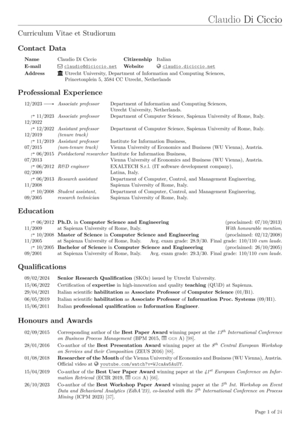

# Claudio's Academic CV
This repository contains my own Curriculum Vitae compiled with LaTeX. It is not yet a template, as it contains my own information, but feel free to fork it and change it as you see fit.
It requires the following packages installed:
* [LuaTeX](https://www.luatex.org/)
* [Biber](https://ctan.org/pkg/biber)
* [Academicons](https://ctan.org/tex-archive/fonts/academicons)
* [Fontawesome](https://ctan.org/pkg/fontawesome)

This is how the first page looks like:

